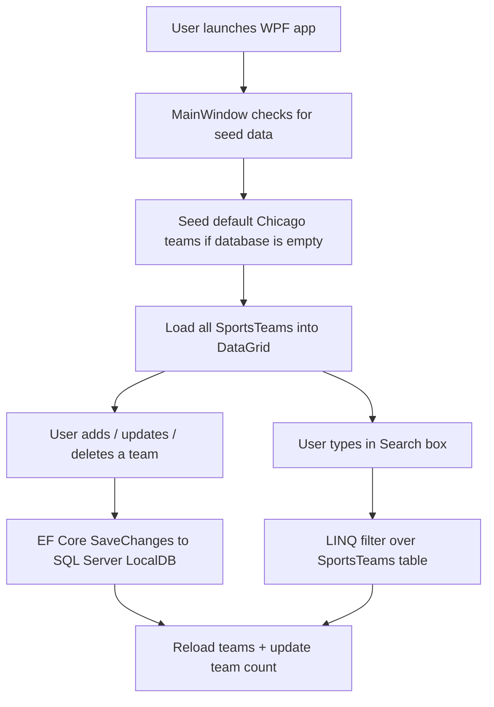

<p align="center">
  
</p>

# 🏅 Sports Team Manager  
### Assignment 10.3 – WPF Desktop App • EF Core • SQL Server LocalDB • MSSA Project

---

## 🎥 Demo Video (Coming Soon)

A full video demonstration will be added here.

---

## 📖 Project Summary

Sports Team Manager is a **WPF desktop application** that manages sports teams with full CRUD functionality.  
The focus of this assignment is on **backend skills**: C#, **Entity Framework Core**, **SQL Server LocalDB**, database **migrations**, and basic querying, with a simple WPF UI on top.

This project is part of **Assignment 10.3 – SportsTeamManager (WPF)** in the MSSA Cloud Application Development program.

---

## ⭐ Core Features

- Full **CRUD operations** for sports teams  
- **DataGrid** bound directly to EF Core query results  
- **ComboBox** for selecting a sport  
- SQL Server LocalDB handled through **EF Core**  
- Database **migrations** to evolve the schema safely  
- Built‑in **search** by team name, city, or sport  
- Automatic **team count** display in the UI  

> 💡 **Seed Data:**  
> On first run, the app automatically seeds three Chicago teams into the database:  
> - Chicago Bulls (Basketball)  
> - Chicago Bears (Football)  
> - Chicago Cubs (Baseball)  

---

## 🔄 App Workflow (High Level)



---

## 🧱 Tech Stack

- **Language:** C#  
- **Framework:** .NET (WPF)  
- **UI:** WPF (XAML + code-behind)  
- **ORM:** Entity Framework Core  
- **Database:** SQL Server LocalDB (`(localdb)\MSSQLLocalDB`)  
- **Other:** LINQ, EF Core migrations, basic data binding  

WPF is used as a **front-end shell**, while most of the learning is around EF Core, migrations, and backend logic.

---

## 🗂️ Folder Structure

```text
SportsTeamManager/
├── SportsTeamManager.sln
├── README.md
├── .gitignore
└── SportsTeamManager/
    ├── App.xaml
    ├── App.xaml.cs
    ├── MainWindow.xaml
    ├── MainWindow.xaml.cs          // event handlers + CRUD + search
    ├── Data/
    │   ├── AppDbContext.cs         // EF Core DbContext
    │   └── Migrations/             // EF Core migration files + snapshot
    ├── Models/
    │   └── SportsTeam.cs           // entity model for EF Core
    └── Properties/                 // WPF app metadata
```

Update folder names if your solution is organized slightly differently.

---

## 🧩 Architecture Overview

```mermaid
flowchart LR
    UI[WPF UI\n(MainWindow + controls)] --> B[Code-behind\n(event handlers)]
    B --> C[EF Core\n(AppDbContext)]
    C --> D[(SQL Server LocalDB\nSportsTeamDB)]
```

- The **WPF UI** (XAML + code-behind) handles buttons, text boxes, DataGrid, ComboBox, and search input.  
- The **code-behind** calls **AppDbContext** to query and save `SportsTeam` records.  
- **EF Core** maps the `SportsTeam` model to the **SportsTeamDB** LocalDB database using migrations.

---

## 🗃️ Database Model Example

### AppDbContext

```csharp
using Microsoft.EntityFrameworkCore;
using SportsTeamManager.Models;

namespace SportsTeamManager.Data
{
    public class AppDbContext : DbContext
    {
        public DbSet<SportsTeam> SportsTeams => Set<SportsTeam>();

        protected override void OnConfiguring(DbContextOptionsBuilder optionsBuilder)
        {
            optionsBuilder.UseSqlServer(
                "Server=(localdb)\\MSSQLLocalDB;Database=SportsTeamDB;Trusted_Connection=True;");
        }
    }
}
```

### SportsTeam Entity

```csharp
using System.ComponentModel.DataAnnotations;

namespace SportsTeamManager.Models
{
    public class SportsTeam
    {
        [Key]
        public int TeamId { get; set; }
        public string? Name { get; set; }
        public string? City { get; set; }
        public string? Sport { get; set; }
        public int FoundedYear { get; set; }
        public int ChampionshipsWon { get; set; }
    }
}
```

EF Core maps this class into a `SportsTeams` table with `TeamId` as the identity primary key, plus the additional fields for team metadata.

---

## 💻 Sample CRUD and Search Logic (MainWindow.xaml.cs)

### Seeding Data and Initial Load

```csharp
public partial class MainWindow : Window
{
    private readonly AppDbContext _context = new AppDbContext();

    public MainWindow()
    {
        InitializeComponent();

        // Seed default Chicago teams if database is empty
        if (!_context.SportsTeams.Any())
        {
            _context.SportsTeams.Add(new SportsTeam
            {
                Name = "Chicago Bulls",
                City = "Chicago",
                Sport = "Basketball",
                FoundedYear = 1966,
                ChampionshipsWon = 6
            });

            _context.SportsTeams.Add(new SportsTeam
            {
                Name = "Chicago Bears",
                City = "Chicago",
                Sport = "Football",
                FoundedYear = 1919,
                ChampionshipsWon = 1
            });

            _context.SportsTeams.Add(new SportsTeam
            {
                Name = "Chicago Cubs",
                City = "Chicago",
                Sport = "Baseball",
                FoundedYear = 1876,
                ChampionshipsWon = 3
            });

            _context.SaveChanges();
        }

        LoadTeams();

        UpdateButton.IsEnabled = false;
        DeleteButton.IsEnabled = false;
    }

    private void LoadTeams()
    {
        var teams = _context.SportsTeams.ToList();
        TeamsDataGrid.ItemsSource = teams;
        TeamCountTextBlock.Text = $"Total Teams: {teams.Count}";
    }
}
```

### Validation Helper

```csharp
private bool ValidateInputs()
{
    if (string.IsNullOrWhiteSpace(NameTextBox.Text) ||
        string.IsNullOrWhiteSpace(CityTextBox.Text) ||
        SportComboBox.SelectedItem == null)
    {
        MessageBox.Show("Name, City, and Sport are required.");
        return false;
    }

    if (!int.TryParse(FoundedYearTextBox.Text, out _) ||
        !int.TryParse(ChampionshipsTextBox.Text, out _))
    {
        MessageBox.Show("Founded Year and Championships must be numbers.");
        return false;
    }

    return true;
}
```

### Create (Add)

```csharp
private void AddButton_Click(object sender, RoutedEventArgs e)
{
    if (!ValidateInputs()) return;

    var team = new SportsTeam
    {
        Name = NameTextBox.Text,
        City = CityTextBox.Text,
        Sport = (SportComboBox.SelectedItem as ComboBoxItem)?.Content.ToString(),
        FoundedYear = int.Parse(FoundedYearTextBox.Text),
        ChampionshipsWon = int.Parse(ChampionshipsTextBox.Text)
    };

    _context.SportsTeams.Add(team);
    _context.SaveChanges();
    LoadTeams();
    ClearInputs();
}
```

### Update

```csharp
private void UpdateButton_Click(object sender, RoutedEventArgs e)
{
    if (TeamsDataGrid.SelectedItem is not SportsTeam selected) return;
    if (!ValidateInputs()) return;

    selected.Name = NameTextBox.Text;
    selected.City = CityTextBox.Text;
    selected.Sport = (SportComboBox.SelectedItem as ComboBoxItem)?.Content.ToString();
    selected.FoundedYear = int.Parse(FoundedYearTextBox.Text);
    selected.ChampionshipsWon = int.Parse(ChampionshipsTextBox.Text);

    _context.SaveChanges();
    LoadTeams();
}
```

### Delete

```csharp
private void DeleteButton_Click(object sender, RoutedEventArgs e)
{
    if (TeamsDataGrid.SelectedItem is not SportsTeam selected) return;

    var result = MessageBox.Show(
        $"Are you sure you want to delete '{selected.Name}'?",
        "Confirm Delete",
        MessageBoxButton.YesNo,
        MessageBoxImage.Warning);

    if (result == MessageBoxResult.Yes)
    {
        _context.SportsTeams.Remove(selected);
        _context.SaveChanges();
        LoadTeams();
        ClearInputs();
    }
}
```

### Selection Handling and Clear

```csharp
private void TeamsDataGrid_SelectionChanged(object sender, SelectionChangedEventArgs e)
{
    if (TeamsDataGrid.SelectedItem is SportsTeam selected)
    {
        NameTextBox.Text = selected.Name;
        CityTextBox.Text = selected.City;

        SportComboBox.SelectedItem = SportComboBox.Items
            .Cast<ComboBoxItem>()
            .FirstOrDefault(i => i.Content.ToString() == selected.Sport);

        FoundedYearTextBox.Text = selected.FoundedYear.ToString();
        ChampionshipsTextBox.Text = selected.ChampionshipsWon.ToString();

        UpdateButton.IsEnabled = true;
        DeleteButton.IsEnabled = true;
    }
    else
    {
        UpdateButton.IsEnabled = false;
        DeleteButton.IsEnabled = false;
    }
}

private void ClearButton_Click(object sender, RoutedEventArgs e)
{
    ClearInputs();
    TeamsDataGrid.UnselectAll();
}

private void ClearInputs()
{
    NameTextBox.Text = "";
    CityTextBox.Text = "";
    SportComboBox.SelectedItem = null;
    FoundedYearTextBox.Text = "";
    ChampionshipsTextBox.Text = "";
}
```

### Search (Live Filter)

```csharp
private void SearchTextBox_TextChanged(object sender, TextChangedEventArgs e)
{
    string search = SearchTextBox.Text.ToLower();

    var filtered = _context.SportsTeams
        .Where(t =>
            t.Name.ToLower().Contains(search) ||
            t.City.ToLower().Contains(search) ||
            t.Sport.ToLower().Contains(search))
        .ToList();

    TeamsDataGrid.ItemsSource = filtered;
    TeamCountTextBlock.Text = $"Total Teams: {filtered.Count}";
}
```

---

## 🚀 How to Run

1. **Clone** the repository.  
2. Open the solution in **Visual Studio**: `SportsTeamManager.sln`.  
3. Restore NuGet packages for **EF Core** and the **SQL Server** provider.  
4. From **Package Manager Console**, run:
   - `Update-Database`
5. Set `SportsTeamManager` as the **Startup Project**.  
6. Press **F5** or `Ctrl + F5` to run the application.

On first run, the app seeds three **Chicago teams** into the LocalDB database if it is empty.

---

## 📌 Future Improvements

- Add a **Player** entity and relate it to `SportsTeam` (one-to-many)  
- Add a small **Web API** layer on top of this EF Core backend  
- Move logic from code-behind into a more **MVVM-style** structure  
- Add validation summaries and more robust error handling  
- Implement stats dashboards and additional filtering/sorting with LINQ  

---

## 👨‍💻 Author

**Bobby Rovy**  
U.S. Army Veteran • Software Engineer in Transition  
MSSA Cloud Application Development (2026)
